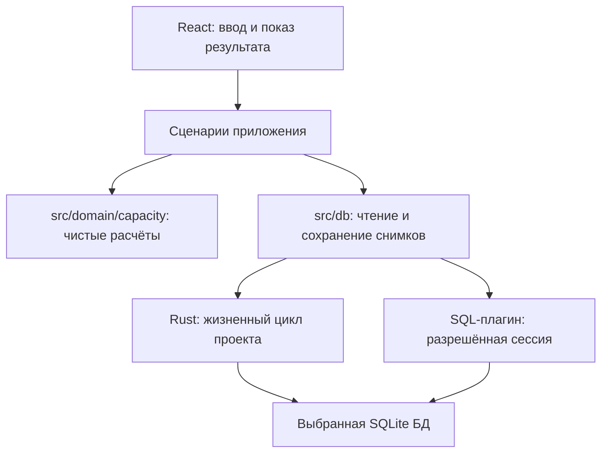

# Локальные проекты — согласованная архитектура и проверка реализации

Дата: 2026-09-23. Статус: подход СОГЛАСОВАН PO в DEC-016; UI-интеграция разрешена DEC-019.
Основание: согласованный ../product/MVP.md и ../system/MODEL.md.
Расчётное ядро, адаптер снимков и native-хранилище подключены к новому UI проектов.
Production-запуск использует общие с IPC-тестом команды; старый preload отключён.
Результаты WebView-проверки фиксируются в ../audit/PROJECT_WORKFLOW.md;
пригодность portable-доставки на целевых Windows/macOS остаётся отдельной проверкой.

## Рекомендация

Сохранить Tauri 2 + React + SQLite и `@tauri-apps/plugin-sql`.
Одна команда — одна выбранная пользователем папка с `capacity.sqlite`.
Каждый квартал хранить отдельным полным снимком внутри SQLite. Изменение участника,
календаря, долей или задачи сохраняет выбранный квартал одной атомарной SQL-записью.
Папка приложения и папки данных независимы: замена распакованной программы не
должна заменять пользовательские проекты.

Узкий Rust-модуль отвечает за проверку файла, открытие, владение проектом,
закрытие и будущие миграции. Прикладные SQL-запросы остаются в `src/db/`, формулы —
в `src/domain/capacity/`. Серверная часть не появляется.

```text
Выбранная папка команды/
  capacity.sqlite     данные проекта и квартальные снимки
```

Во время работы возможны служебные файлы SQLite и блокировки. Переносимая копия
для MVP — копия всей папки после полного закрытия проекта. Работа с общей сетевой
папкой или синхронная запись несколькими экземплярами не поддерживаются.
Специальный экспорт открытого проекта относится к будущей задаче.

## Почему снимок квартала

| Вариант | Преимущество | Цена |
| --- | --- | --- |
| SQLite: снимок квартала в JSON, одна запись | Простое атомарное сохранение, независимость кварталов; остаётся выбранный SQLite/SQL-плагин | Внутренние ссылки проверяются приложением, не внешними ключами SQLite; SQL-аналитика внутри снимка ограничена. |
| Нормализованные SQLite-таблицы всех сущностей | Связи и часть ограничений контролирует БД | Изменение плана требует настоящей транзакции из нескольких запросов и большего native-слоя. |
| Полный native repository | Единый контроль БД в Rust | Перенос прикладного persistence-кода; для текущего масштаба не обоснован. |

Снимок содержит все изменяемые сведения своего квартала: календарь, компетенции,
состав, ставки, отсутствия, направления и задачи. Не ссылается на изменяемые данные
другого плана. Вычисленные своды не являются самостоятельным источником истины.

## Физическая модель первой реализации

| Таблица | Поля и ограничения |
| --- | --- |
| project_meta | Одна запись: project_id, название, версия формата проекта. |
| quarter_plans | plan_id; year/quarter с UNIQUE; revision >= 1; payload_version; payload_json. |

Версия схемы SQLite отделена от версии JSON. Версия формата и `application_id`
обозначают наш проект, но не делают входные данные доверенными.
Реализация поддерживает только схему 1; остальные версии отклоняются.
Обновления существующих схем и резервное копирование перед ними пока не реализованы.
SQLite обеспечивает уникальность квартала и атомарность записи; Zod и доменные
валидаторы проверяют форму, ссылки и числовые ограничения снимка при чтении и записи.
Служебные SQL-поля года/квартала должны совпадать с содержимым снимка.
Валидность для хранения отделена от готовности к расчёту: null оценки, сумма долей
не 100% и явно незавершённая подготовка календаря сохраняются как черновик.
Неполный календарь не разрешает численный расчёт capacity, но не означает
повреждение файла. Неверные ссылки, версии и недопустимые значения не принимаются.

Новый квартал: отдельный INSERT, ошибка уникальности означает существующий план.
Изменение существующего: один UPDATE payload/revision с условием ожидаемой revision.
Ноль изменённых строк — конфликт или исчезнувший план, не успешное сохранение.
После конфликта нельзя автоматически перезаписывать более новую ревизию.
Последовательная очередь сохранений не должна помечать более поздние правки UI
сохранёнными после завершения записи более раннего снимка.
Сохранение квартала не требует одновременной записи metadata или другого квартала.

Это не пользовательская история версий. Увеличение revision защищает от устаревшей
записи. Для атомарности операций над несколькими строками, включая будущие миграции,
нужна явная транзакция на одном native-соединении.

## Границы модулей



React не выполняет SQL и не реализует формулы. `src/db/` получает handle проверенной
сессии, не собирает URL из произвольного пути пользователя. Последние открытые папки
и настройки окна могут храниться в настройках приложения; они не заменяют данные
проекта и не являются обязательными для повторного открытия папки.

**Принятое узкое уточнение AGENTS:** правило «все обращения к SQLite
в src/db» распространяется на прикладные запросы TypeScript; Rust-модуль
`src-tauri/src/project_store/` вправе проверять формат БД, создавать соединение,
выполнять служебные миграции и закрывать его. Бизнес-формулы и прикладные репозитории
в Rust не переносятся. Уточнение действует после DEC-016.

## Открытие, закрытие и сохранность

Ниже — целевой контракт. Native-хранилище и тестовый IPC-контур реализуют его
проверенную часть; production `main`, конфигурация и capabilities пока сохраняют
legacy-поток. Удаление preload и подключение ограничений к запуску приложения
остаются задачей интеграции. Проверка rollback миграции на fixture не означает
готовности production-миграций или резервного копирования.

1. Различать «создать» и «открыть». Открытие не создаёт отсутствующий файл.
   Создание не перезаписывает существующую БД и посторонние файлы папки.
2. Нормализовать native-путь и получить эксклюзивное владение проектом между
   экземплярами приложения. Не использовать наличие обычного lock-файла как
   единственное доказательство живой блокировки после сбоя. Само получение
   блокировки не должно создавать/менять файлы в ещё не проверенной чужой папке.
3. Проверить принадлежность и поддерживаемый формат до изменяющего открытия и
   миграций. Чужие/слишком новые/повреждённые файлы отклонять без изменений содержимого.
   Read-only SQL-проверка сама по себе не доказывает отсутствие новых служебных файлов;
   неизменность папки проверяется отдельным тестом.
4. Создать SQLx pool через native filename(PathBuf), зарегистрировать его в
   `DbInstances` с новым непрозрачным ключом для каждой сессии. Старый handle не
   должен оживать при повторном открытии того же проекта. JS использует `Database.get(key)` для уже
   проверенного pool. Прямые plugin load/close не предоставлять на уровне Tauri
   capabilities: вместо `sql:default`/`sql:allow-load` разрешить только требуемые
   select/execute и собственные native-команды жизненного цикла.
   При подключении нового запуска убрать старый SQL preload `sqlite:capacity.db`,
   иначе он открывает общую БД до выбора проекта. Старый файл при этом не удалять
   и автоматически не мигрировать. Проверить реальным IPC-вызовом, что запрещённый
   load/close отклоняется, а не только отсутствие таких вызовов в UI.
5. Первая реализация использует один connection на проект и rollback journal (`DELETE`);
   реальные journal mode и настройки durability входят в проверки хранилища.
   Это упрощает последовательную запись; WAL по умолчанию не принимать неявно.
6. На закрытии запретить новые операции, дождаться текущих, закрыть конкретный pool,
   удалить его регистрацию и отпустить владение. При ошибке сохранения показать
   несохранённое состояние, а не незаметно закрыть план.
7. До миграции проверить версию и согласованность данных; сохранить восстанавливаемую
   копию. Миграция схемы/снимков и её версия выполняются в одной native-транзакции
   либо заранее обоснованной последовательности с восстановлением. Чужую БД не мигрировать.

Восстановление собственного проекта с незавершённым журналом после сбоя входит
в проверки пробной реализации. Нельзя открывать неизвестный файл с разрешением записи
только ради проверки или объявлять режим read-only универсальным решением recovery.
Проверки протокола preflight/recovery на временных БД не заменяют проверку
жизненного цикла через настоящий WebView при подключении UI.
Обязательные ограничения offline-интерфейса: только встроенные ресурсы, запрет
удалённой навигации/сетевых соединений в конфигурации WebView и CSP, отсутствие
телеметрии; пользовательский текст выводится как текст. Прикладные SQL-запросы
статичны и используют параметры, содержимое проекта не исполняется как SQL/HTML.
Проверка исходящих соединений остаётся отдельной от настройки ограничений.

## Исходное обследование зависимостей

До реализации по package-lock/Cargo.lock и установленным исходникам: JS SQL-плагин 2.2.0,
Rust SQL-плагин 2.4.0, SQLx 0.8.6, libsqlite3-sys 0.30.1. Версия Rust в Cargo.toml
задана диапазоном, поэтому не совпадает с буквально указанным номером 2.2.0.

В Rust-плагине 2.4.0 `load` может создать отсутствующую БД до нашей проверки;
списки миграций привязаны к URL и забираются из registry при load. JS `execute`
использует pool: отдельные BEGIN/UPDATE/COMMIT не гарантируют одну транзакцию.
`close()` без конкретного ключа закрывает все pools. Поэтому собственный жизненный
цикл нужен даже при сохранении SQL-плагина. Доступность регистрации pool подтверждается
[публичным API DbInstances 2.4.0](https://docs.rs/tauri-plugin-sql/2.4.0/tauri_plugin_sql/struct.DbInstances.html);
завершение операций при закрытии — [SQLx Pool.close](https://docs.rs/sqlx/0.8.6/sqlx/struct.Pool.html#method.close).

Локальные основания: `tauri-plugin-sql-2.4.0/src/wrapper.rs` (создание/пути),
`src/commands.rs` (load/execute/close), `src/lib.rs` (DbInstances),
`sqlx-sqlite-0.8.6/src/migrate.rs` (транзакция отдельной миграции).
Физические пути пользователя нельзя безопасно подменять строковым SQL URL
без отдельной проверки спецсимволов; native filename избегает этой неоднозначности.

При исходном обследовании bundled SQLite содержал 3.46.0; runtime-версия тогда не измерялась.
Она попадает в описанный SQLite диапазон редкой ошибки WAL-reset при конкурирующих
соединениях. Инцидент не воспроизводился; это причина явно проверять engine,
режим журнала и число соединений, а до выпуска проверить обновление зависимостей.
Выбранный rollback journal не использует затронутый WAL-путь; это не заменяет
проверку актуальности зависимостей. [Описание SQLite](https://www.sqlite.org/wal.html#walreset).

## Исходная проверка среды до реализации

2026-09-23, отдельный агент /root/audit_review:

| Проверка | Результат |
| --- | --- |
| `npm run build` | PASS: TypeScript и Vite 6.4.3. |
| `cargo check --locked --offline` | PASS: Rust dev check, Windows x64. |
| Среда | Windows x64, Node 20.13.1, Rust/Cargo 1.96.1, VS 2022 BuildTools. |
| WebView2 | Runtime 153.0.4234.48 найден в реестре этой машины. |
| Исходники/lockfiles | В этой диагностике не менялись; изменились только игнорируемые результаты сборки. |

Эта исходная диагностика не проверяла предлагаемое хранилище и выпуск приложения.
В ходе неё приложение не запускалось, пользовательская БД не открывалась.

## Результат первой изолированной реализации

2026-09-23, после реализации и независимого review:

| Проверка | Результат |
| --- | --- |
| `npm test` | PASS: 87 тестов. |
| `npm run build` | PASS: frontend-сборка. |
| `cargo test --offline` | PASS: 13 lib-тестов и 1 IPC-тест; 1 вспомогательный subprocess-тест помечен ignored. |
| IPC-контур | Реальные SQL-плагин, SQLite и ACL в Tauri MockRuntime; настоящий WebView не участвует. |
| `npm run tauri build -- --no-bundle`, `CARGO_NET_OFFLINE=true` | PASS: Windows release `src-tauri/target/release/capacity-planner.exe`; не запускался, production main сохраняет legacy-поток. |

TS-тесты адаптера с mock invoke проверяют контракт клиента, а не выполнение SQLite.
Rust IPC-тест отдельно проверяет разрешённые и запрещённые вызовы реального плагина.
При независимом native-review исправлены освобождение владения в Drop, отмена
close/open, единый лимит чтения и записи 128 MiB и повтор создания после неудачи.
Подробные результаты и актуальный статус сборки Windows release —
[в отчёте первой реализации](../audit/IMPLEMENTATION_STEP_01.md).

Остаются ограничения пробной реализации:

- Создание публикует подготовленную БД через hard link и требует его поддержки
  файловой системой. Работа этого механизма на macOS здесь не проверена.
- После аварийного завершения создания может остаться staging-каталог; автоматической
  очистки таких остатков пока нет.
- 128 MiB — технический лимит текущего хранилища, одинаковый при чтении и записи,
  а не согласованный продуктовый предел размера проекта.
- Поддерживается только схема 1. Rollback миграции проверен на тестовом fixture;
  production-обновления формата и предварительные резервные копии не реализованы.
- Метаданные происхождения и версии производственного календаря, а также происхождения
  ручных поправок требуют отдельного уточнения перед подключением календарного UI.
- Production `main`/config/capabilities ещё не подключены к новому хранилищу;
  прохождение fixture-тестов не доказывает ограничения действующего запуска.

Эти результаты не подтверждают portable ZIP, первый запуск без администратора,
работу без сети, отсутствие исходящих соединений или macOS. Успешная компиляция
Windows release сама по себе также не закрывает эти проверки.

Windows-доставка требует решения о WebView2: системный Runtime либо поставляемый
рядом фиксированный Runtime, если это проходит корпоративные ограничения.
Второй вариант увеличивает архив и требует обновлять Runtime с приложением.
Установщик Runtime не удовлетворяет требованию «без установки».
[Microsoft: варианты распространения](https://learn.microsoft.com/en-us/microsoft-edge/webview2/concepts/distribution).
Для macOS нужен собственный цикл сборки и проверки подписанного/нотарифицированного
приложения; Windows-проверки его не заменяют.
[Apple: notarization workflow](https://developer.apple.com/documentation/security/customizing-the-notarization-workflow).

## Последовательность небольших задач

1. Расчётное ядро и Vitest по ../system/MODEL.md реализованы; старый UI/БД не подключены.
2. Первая проверка хранилища выполнена в изоляции: native pool → SQL-плагин → чтение/CAS-save;
   пути с кириллицей/пробелами/спецсимволами; два проекта и два процесса;
   повреждённый/чужой/будущий формат без изменений; ошибки записи и закрытия;
   сбой миграции на fixture/recovery; перенос закрытой копии. Только временные проекты.
   Ограничения этого результата перечислены выше; production-интеграция и WebView ещё впереди.
3. Проверка выпуска на Windows/macOS: распаковка, первый запуск, создание/сохранение/
   повторное открытие без сети, установки и повышения прав; отдельно наблюдение
   исходящих соединений при включённой сети. Зафиксировать поддержанные ОС/архитектуры.
4. Подключение экранов проектов, квартала, команды, отсутствий, направлений и задач
   небольшими вертикальными изменениями; замена старого потока только с проверками.

Первые две задачи дали изолированную реализацию и результаты тестов.
PO разрешил текущую UI-интеграцию в DEC-019 после результатов хранилища;
незавершённые проверки доставки сохраняются явными ограничениями выпуска.
Старые данные/миграции не удалять и не применять к ним новый формат автоматически.

## Независимое review

Reviewer /root/audit_review, 2026-09-23: модель снимка/CAS и расчётные контракты
согласуются с MVP. Уточнены две границы: сохранение корректного черновика не требует
готовности к расчёту; native lifecycle должен обеспечиваться capabilities и удалением
legacy preload из нового запуска, а не соглашением внутри UI.
После реализации дополнительно выполнено независимое review расчётного ядра,
адаптера/IPC и native-хранилища; найденные ошибки исправлены до итоговых проверок.
Ограничения пробной реализации и неподтверждённая portable-доставка сохранены явно.

## Архитектурный checkpoint

Рекомендация: SQLite со снимком на квартал, чистое TypeScript-ядро, узкий Rust-модуль
жизненного цикла и сохранение SQL-плагина; затем задачи 1–3 с указанными ограничениями.
Альтернатива: нормализованные таблицы и более широкий native transaction-слой.
Критерий выбора — достаточная надёжность при минимальном объёме кода для текущего MVP.

Решение PO получено: «Вроде как да. Если требуется то самостоятельно проведи ревью еще.
Что дальше?». Подход и узкая граница SQLite приняты; дополнительное review делается самостоятельно.
Статус: СОГЛАСОВАНО (DEC-016). Базовая native/JS связка реализована и проверена
в изоляции; production-интеграция выполнена по DEC-019, поддержка конкретных ОС проверяется отдельно.
Если дальнейшие проверки выявят непригодность связки, альтернативный persistence-подход возвращается
на решение PO; native-слой не расширяется до полного репозитория молча.
