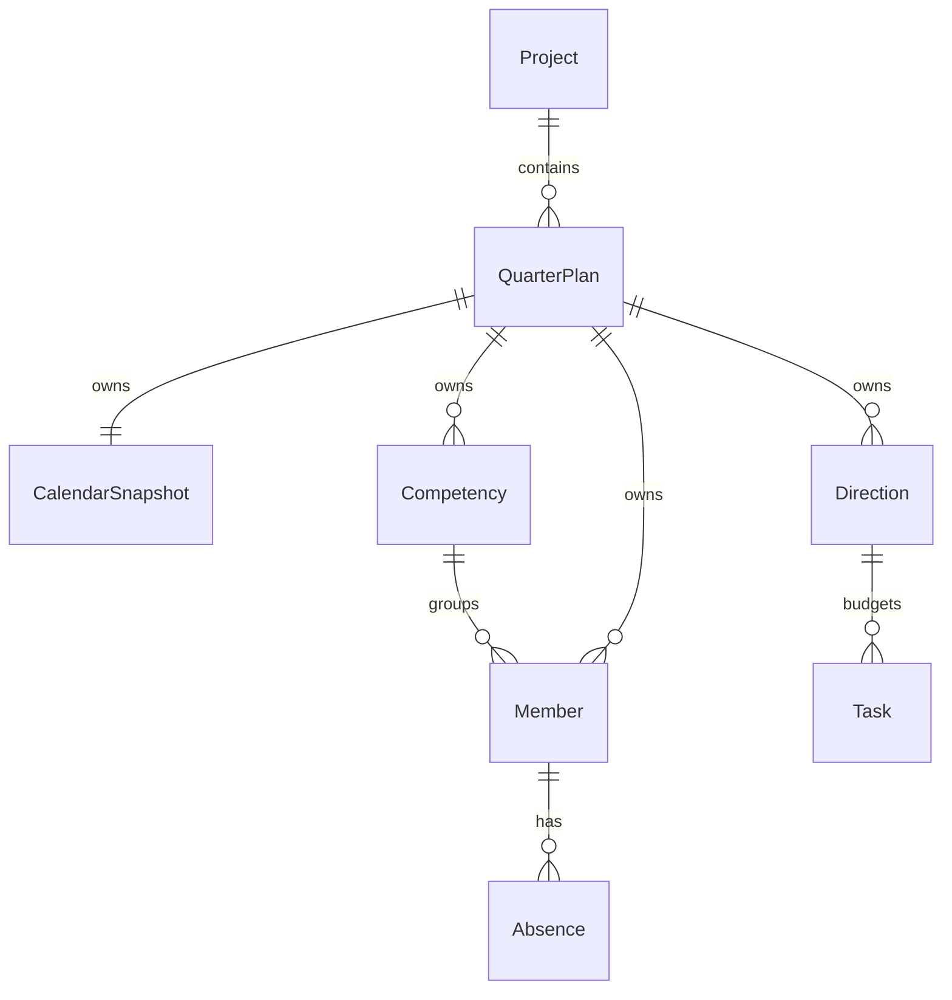

# Capacity Manager — модель и правила системы

Дата: 2026-09-23. Статус: подход принят на архитектурном checkpoint (DEC-016);
новое расчётное ядро реализовано и проверено отдельно от UI.
Фактические результаты и границы реализации: ../audit/IMPLEMENTATION_STEP_01.md.
Продуктовый источник: ../product/MVP.md. Этот документ не расширяет scope.
Физическое хранение и границы native-части рассматриваются отдельно в
../architecture/LOCAL_PROJECTS.md.

## Объекты и границы изменений

| Объект | Данные | Область действия |
| --- | --- | --- |
| Проект команды | Стабильный ID, название, версия формата | Одна пользовательская папка; путь не зашивается в переносимые данные. |
| План квартала | ID, год, квартал 1–4, версия содержимого, ревизия сохранения | Один план для сочетания года и квартала в проекте; сценарии и версии планирования вне MVP. |
| Календарь плана | Все календарные даты квартала с итоговым признаком рабочей даты, источник/версия базового календаря и сведения о ручных поправках | Снимок внутри конкретного плана; обновление справочника не меняет его молча. |
| Компетенция | ID и название | Справочник данного плана; изменение названия не меняет другие кварталы. |
| Участник | ID, имя, ID одной компетенции, ставка | Данный план; ставка постоянна для его квартала. |
| Отсутствие | ID, ID участника, начальная/конечная даты | Целые дни; обе границы включены. |
| Направление | ID, название, процент | Данный план; одни доли применяются ко всей команде. |
| Задача | ID, название, ID направления, оценка часов или null | Данный квартал; без статуса исполнения и распределения по людям. |

ID не зависят от порядка строк, имени человека или названия направления.
Ссылки между объектами разрешаются только внутри одного плана. Одинаковое имя
человека в двух проектах не связывает их данные автоматически.
Ревизия сохранения — техническая защита от устаревшей записи, не история версий UI.

Новый квартал получает собственные данные. Функция копирования предыдущего плана
не является зависимостью первого расчётного ядра; если она появится, копия должна
получать независимые ссылки и не синхронизироваться с исходником.

## Даты, календарь и числовые значения

- Даты — проверенные значения YYYY-MM-DD без времени и часового пояса. Проверяется
  существование даты, а не только совпадение со строковым шаблоном.
- Календарь включает каждую дату выбранного квартала ровно один раз. Неизвестная дата
  не равна выходному; отсутствующий календарь не равен нулевой ёмкости.
- Источник базового календаря загружается из ресурсов приложения офлайн.
  Для неизвестного года нет молчаливой подмены календаря РФ обычной пятидневкой.
  Ручной календарь должен быть явно подготовлен пользователем до полного расчёта.
- Ручная поправка рабочей даты одновременно влияет на доступность и пересечение
  с отсутствием. Сокращённые часы не моделируются: рабочая дата равна 8 ч до ставки.
- На границе ядра и в сохраняемых данных дроби представлены каноническими
  десятичными строками: ставка "0.5", процент "20", часы "41.6".
  UI допускает привычную запятую и преобразует её до вызова ядра.
- Внутри ядра требуется точная десятичная арифметика переменной точности.
  Нужны сложение, вычитание, умножение и деление на 100; результат всегда конечная
  десятичная дробь. Выбор маленького внутреннего модуля или библиотеки — отдельная
  деталь задачи; без скрытого ограничения ввода двумя знаками и без epsilon для 100%.
- BigInt/внутренние структуры чисел не попадают в JSON. Проверяются формат и границы:
  ставка 0–1, отдельный процент 0–100, оценка >= 0. NaN и Infinity недопустимы.
  Технические ограничения размера входа должны предотвращать зависание, но не
  подменять точность расчёта неоговорённым округлением.
- До вывода значения не округляются. Отображение — два знака, половина округляется
  от нуля; исходные значения используются при суммировании и определении дефицита.
  При малом ненулевом дефиците, округлённом до 0,00, интерфейс показывает «меньше 0,01 ч».

## Чистое расчётное ядро

Контракт: `calculateQuarterCapacity(snapshot) -> result | validationErrors`.
Ядро не читает SQLite, глобальный календарь, текущую дату, сеть или React state;
не меняет вход. Одинаковый снимок даёт одинаковые значения независимо от порядка строк.

1. Для каждого человека построить множество отсутствующих рабочих дат:
   объединить интервалы, пересечь с кварталом и рабочими датами календаря.
2. Доступные дни = рабочие даты квартала − размер этого множества.
3. Часы человека = доступные дни × 8 × ставка. Ставка применяется один раз.
4. Часы команды и компетенций = суммы часов соответствующих участников.
5. Бюджет направления = часы команды × процент / 100.
6. Известная потребность = сумма заполненных оценок задач направления.
   Отдельно вернуть число задач без оценки; оценки задач не умножать на ставку.
7. Остаток по известным оценкам = бюджет − известная потребность.
   Превышение по известным оценкам = max(0, −остаток).

Полный квартал без рабочих дат, пустая команда и ставка 0 дают нулевую ёмкость.
Деление на ёмкость для основного результата не требуется. Нет расчёта спринтов,
производственного коэффициента, утилизации или фактически затраченного времени.

## Полнота результата и ошибки

| Состояние | Бюджет | Потребность | Остаток |
| --- | --- | --- | --- |
| Доли дают 100%, все оценки направления заполнены | Полный | Полная | Полный |
| Допустимые доли дают меньше/больше 100% | Предварительный | Зависит от оценок | Предварительный |
| В направлении есть оценка null | Зависит от долей | Неполная, отдельно известная сумма | Предварительный |
| Нет задач направления | По выделенной доле | 0, полная | Резерв внутри направления |

При неполном результате подтверждённый остаток возвращается как null, а не как
положительное количество свободных часов. Числа по известным оценкам можно показать
с явной пометкой. Неполная оценка одного направления не делает потребность другого
неполной; общий итог потребности наследует наличие любых незаполненных оценок.

Статус черновика вычисляется из содержимого, а не сохраняется независимым флагом,
который может рассогласоваться с данными. Черновики 90% и 110% сохраняются одинаково.
Превышение бюджета не является ошибкой ввода и не запрещает сохранение.

Ошибки ввода: несуществующие/обратные даты, неполный календарь для расчёта,
дубли ID, ссылки на неизвестные сущности, отрицательные оценки, недопустимые ставки
и отдельные доли. Синтаксически неверные промежуточные поля UI не заменяют ранее
сохранённое корректное значение. null оценки — допустимое состояние задачи.
Неполный календарь допускает подготовку плана, но до его заполнения результат
capacity отсутствует, а не равен нулю.

Добавление/удаление участника меняет весь выбранный план. Связанные с удаляемым
участником отсутствия удаляются в той же операции с явным подтверждением действия
в UI; задачи направлений при этом остаются и могут показать дефицит.
Используемую компетенцию нельзя удалить без переназначения участников.
Направление с задачами удаляется только после явного переноса задач или отмены.
Ни одна из этих операций не затрагивает другие кварталы или проекты.

## Основные сценарии

1. Создать/открыть проект: выбрать папку, проверить формат, показать текущую команду;
   при ошибке не создавать новый проект поверх существующих данных.
2. Подготовить квартал: выбрать год/номер, сформировать календарь и задать состав.
3. Изменить исходные данные: проверить ввод, пересчитать снимок, сохранить изменения;
   при ошибке сохранения явно оставить состояние несохранённым.
4. Распределить часы: изменить направления и доли, видеть черновик до суммы 100%.
5. Заполнить задачи: назначить направление и оценку, увидеть остаток или превышение.
6. Закрыть/открыть: корректно завершить запись и получить тот же снимок с теми же результатами.

## Проверки и первая задача реализации

Первая задача — новое расчётное ядро, не подключённое к старому UI до отдельной задачи.
Разрешённые файлы: новые модули в `src/domain/capacity/` и новые тесты в `tests/`.
Существующий калькулятор, его тесты, SQLite и интерфейс не удалять и не менять.
Зависимости не добавлять без обоснования. Источник нормативного календаря не нужен
для тестов: используются явно заданные учебные календарные снимки.

Проверить Vitest: контрольный пример 144 + 64 = 208 ч, продукт 41,6 ч, превышение 8,4 ч;
ставки 0/0,5/0,75/1; отсутствие двойного вычета встреч; объединение отсутствий;
выходные и ручные поправки; границы квартала и високосные даты; неполный календарь;
пустую команду и нулевые бюджеты; точные суммы долей, в том числе
33,333333 + 33,333333 + 33,333334 = 100; черновики 90/110%; null против 0;
резерв встреч; неизменяемый вход и независимость двух снимков.

Приёмка: AC-03–10 из MVP в части чистых вычислений выполнены, все прежние тесты
проходят, TypeScript и frontend-сборка успешны. Интеграционная сохранность и доставка
проверяются последующими задачами и не объявляются выполненными тестами ядра.
